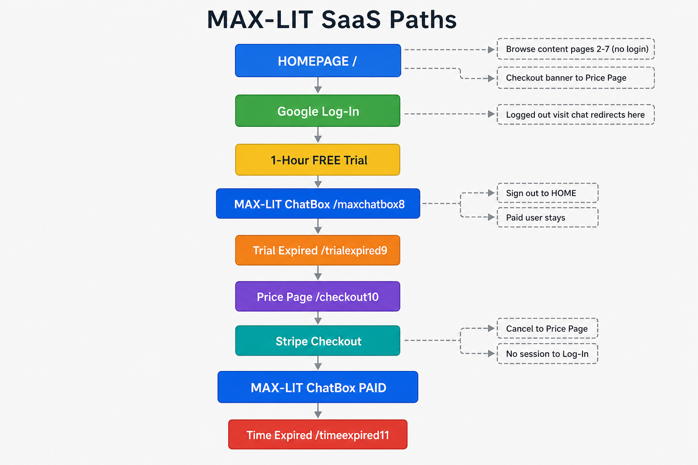

# Restore Point — 2026-08-04

Complete save reference for GitHub code, Vercel secrets, and Stripe config.
**Never commit secret values to GitHub** — they live in Vercel and Stripe dashboards only.

> **SaaS path flow chart:** see image below, or open [`public/max-lit-saas-paths-chart.png`](public/max-lit-saas-paths-chart.png) in the file tree.



## GitHub

- **Repo:** https://github.com/EinsteinErrorcom/EinsteinError.com
- **Branch:** `main`
- **Tag:** `restore-2026-08-04` (created with this restore point)

## Live domains

- https://www.einsteinerror.com (primary)
- https://www.einsteingravity.com (alias)
- https://zzzbestmaxlit.vercel.app (Vercel default)

## Vercel project

- **Dashboard:** https://vercel.com/alwho-9360s-projects/zzzbestmaxlit
- **Env vars:** Settings → Environment Variables

### Required Production + Preview variables (exact names)

| Variable | Purpose |
|---|---|
| `NEXT_PUBLIC_SUPABASE_URL` | Supabase project URL |
| `NEXT_PUBLIC_SUPABASE_ANON_KEY` | Supabase anon/public key |
| `SUPABASE_SERVICE_ROLE_KEY` | Server webhooks, admin, Stripe fulfillment |
| `NEXT_PUBLIC_SITE_URL` | `https://www.einsteinerror.com` |
| `NEXT_PUBLIC_GOOGLE_CLIENT_ID` | Google Sign-In |
| `STRIPE_SECRET_KEY` | Stripe server API |
| `NEXT_PUBLIC_STRIPE_PUBLISHABLE_KEY` | Stripe client |
| `STRIPE_WEBHOOK_SIGNING_SECRET` | Stripe webhook signature verification |
| `GEMINI_API_KEY` | AI chat |
| `AI_PROVIDER` | `gemini` |
| `GEMINI_CONTEXT_CACHE` | `true` |
| `CHAT_RATE_LIMIT_PER_HOUR` | e.g. `20` |

### Do NOT use (removed / legacy)

- ~~`SUPABASE_URL`~~ — use `NEXT_PUBLIC_SUPABASE_URL`
- ~~`SUPABASE_ANON_KEY`~~ — use `NEXT_PUBLIC_SUPABASE_ANON_KEY`
- ~~`STRIPE_WEBHOOK_SECRET`~~ — use `STRIPE_WEBHOOK_SIGNING_SECRET`

Code accepts legacy Supabase names as fallback, but **always set the `NEXT_PUBLIC_*` names in Vercel**.

### After any env var change

1. Redeploy Production (Deployments → ⋯ → Redeploy)
2. Verify home page returns HTTP 200 on both domains

## Stripe

- **Dashboard:** https://dashboard.stripe.com
- **Webhook URL (Production):** `https://www.einsteinerror.com/api/stripe/webhook`
- **Events to listen for:** `checkout.session.completed`, `payment_intent.succeeded`
- **Signing secret:** copy to Vercel as `STRIPE_WEBHOOK_SIGNING_SECRET`

### Pricing tiers (live price IDs in code)

| Tier | Price ID |
|---|---|
| $15 / 3 hours | `price_1U0ACSC39oHx6wOFTQfZCCTF` |
| $75 / 24 hours | `price_1U0ACSC39oHx6wOFWoJosDHi` |
| $400 / 7 days | `price_1U0ACSC39oHx6wOFgtNTWLNV` |

Product ID: `prod_V0AXYbWwPdLkwz`

### If a payment succeeded but user wasn't subscribed

Stripe Dashboard → Developers → Webhooks → select endpoint → **Resend** failed events.

If webhook returns **500 permission denied for table profiles**, run in Supabase SQL Editor:

```sql
grant select, insert, update on table public.profiles to service_role;
```

(Migration: `supabase/migrations/20260804140000_grant_profiles_service_role.sql`)

## 12-page site routes

| # | Route | Role |
|---|---|---|
| 1 | `/` | Home |
| 2–8 | `/page2` … `/page8` | Content |
| 9 | `/maxchatbox9` | AI chat (TRY) |
| 10 | `/trialexpired10` | Trial expired (EXPIRE) |
| 11 | `/checkout11` | Stripe checkout (PAY) |
| 12 | `/timeexpired12` | Time expired (EXPIRE) |

Legacy URLs (`/maxchatbox8`, `/checkout10`, `/spare12`, etc.) redirect to the routes above via `next.config.ts`.

## Quick health check

```bash
curl -s -o /dev/null -w "%{http_code}\n" https://www.einsteinerror.com/
curl -s -o /dev/null -w "%{http_code}\n" https://www.einsteingravity.com/
```

Both should return `200`.

## Related docs

- [HANDOFF-CHART.md](./HANDOFF-CHART.md) — visual handoff chart (project, deploy, site flow, AI, Stripe)
- [USER-FLOWS.md](./USER-FLOWS.md) — all user paths, redirects, intentional vs legacy quirks
