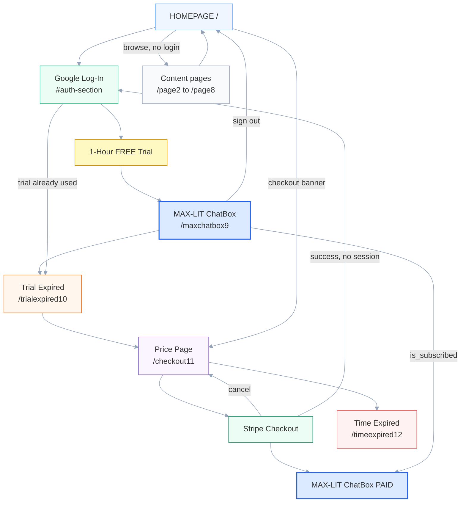

# MAX-LIT User Flows & Paths

Reference for every route, redirect, and user journey in **zzzbestmaxlit**.
Path constants live in `lib/trial-gate.ts`; the 12-page chain is in `lib/site-pages.ts`.

**Domains:** [einsteinerror.com](https://www.einsteinerror.com) (primary), [einsteingravity.com](https://www.einsteingravity.com) (alias)

---

## Canonical 12-page map

Footer **“Next Page →”** on each page follows this order (`lib/site-pages.ts`):

| # | URL | Purpose |
|---|-----|---------|
| 1 | `/` | Home, Google Sign-In, truth counter |
| 2–8 | `/page2` … `/page8` | Marketing / proof content |
| 9 | `/maxchatbox9` | MAX-LIT AI Chatbox (TRY) |
| 10 | `/trialexpired10` | Free 1-hour trial expired (EXPIRE) |
| 11 | `/checkout11` | Stripe checkout ($15 / $75 / $400) (PAY) |
| 12 | `/timeexpired12` | Time expired — cookie gate (EXPIRE) |

Legacy URLs (`/maxchatbox8`, `/checkout10`, `/spare12`, etc.) redirect to the routes above via `next.config.ts`.

---

## Visual summary — SaaS user paths

**Main path (top → bottom):** HOMEPAGE → Google Log-In → 1-Hour FREE Trial → MAX-LIT ChatBox → Trial Expired → Price Page → Stripe → ChatBox (paid)

**To see the colored flow chart:** open **`public/saas-paths.html`** in your browser (click the file in the tree → right-click → Reveal in Finder → double-click). Fits the screen with no scrollbar. No Canvas pane.



**Trial gate:** 1 hour from first sign-in (`profiles.trial_start_at`). After that, chat sends you to Trial Expired unless you have paid (`is_subscribed = true`).

---

## All user paths (by category)

### A. Content browsing (no sign-in)

- `/` → `/page2` → … → `/page8` via footer **Next Page**
- Pages 2–8: **HOME** link → `/`
- **Checkout banner** on `/` and `/page2` → `/checkout11` (skips pages 3–10)
- Pages 1–8, checkout, trial/time-expired pages are readable without logging in

### B. Sign-in entry points

| Entry | Flow | Lands on |
|-------|------|----------|
| Google button on home (primary) | Client `signInWithIdToken` → ensure profile | `/maxchatbox9` |
| `/auth/google` | OAuth → `/auth/callback` | `/maxchatbox9` or `/trialexpired10`* |
| Visit `/maxchatbox9` while logged out | Server redirect | `/#auth-section` |
| Stripe return, auth missing | Preserve `checkout_session_id` | `/?checkout_session_id=…#auth-section` |

\*Returning user whose 1-hour trial already expired → `/trialexpired10`.

**Sign-in errors:** `/?auth=error&reason=…`

**OAuth edge case:** Supabase sometimes returns `code` to `/` instead of `/auth/callback` — home forwards to callback automatically.

### C. Free trial chat (happy path)

```
/ → Google Sign-In → /maxchatbox9 → /api/chat
```

- First sign-in creates `profiles` with `trial_start_at = now`, `is_subscribed = false`
- Chat allowed for **1 hour** while trial active

### D. Free trial expired (page 10)

**Automatic:**

```
Logged in + trial > 1 hr + not paid + visit /maxchatbox9
  → /trialexpired10
```

Also enforced by middleware on `/maxchatbox9` and by `/api/chat` (403 “Trial expired”).

**After sign-in when trial already used:**

```
Google Sign-In → /maxchatbox9 → redirect → /trialexpired10
```

**From page 10:**

- Click TRIALEXPIRED image → `/checkout11`
- Footer **Next Page** → `/checkout11`

### E. Time expired (page 12)

```
Logged in + not paid + trial cookie expired + visit non-exempt URL
  → /timeexpired12
```

Most routes are **trial-exempt** (`lib/supabase/middleware.ts`), so page 12 is commonly reached via:

- Footer chain: `/checkout11` → **Next Page** → `/timeexpired12`
- Site Tour step-through
- Legacy `/chat11` → `/timeexpired12`

**From page 12:** click TIMEEXPIRED image → `/checkout11`

> **Important:** Stripe tiers are labeled 3 hr / 24 hr / 7 days, but code today only sets `is_subscribed = true` with **no paid-duration countdown**. Page 12 uses the 1-hour **trial cookie**, not paid-tier hours.

### F. Paid checkout (page 11)

| Path | Steps |
|------|--------|
| **F1 Standard** | `/checkout11` → tier → Stripe → `/maxchatbox9?session_id=cs_…` → fulfill → chat |
| **F2 Session lost after Stripe** | Stripe → `/maxchatbox9?session_id=…` → `/?checkout_session_id=…#auth-section` → sign in → `/maxchatbox9?session_id=…` → fulfill → chat |
| **F3 Webhook only** | Webhook sets `is_subscribed = true`; user signs in later → chat |
| **F4 Cancel** | Stripe cancel → `/checkout11` |
| **F5 Not signed in at checkout** | Click tier → “Sign in required” → `/#auth-section` |
| **F6 Skip to pricing** | Home banner “Link to MAX-LIT SUPERComputer” → `/checkout11` |

**Stripe config:** `success_url` → `/maxchatbox9?session_id={CHECKOUT_SESSION_ID}`; `cancel_url` → `/checkout11` (`lib/stripe/stripe-service.ts`).

### G. Subscribed user

```
is_subscribed = true → /maxchatbox9 always works; no trial-expiry redirects
```

Sign out from chat → `/`. Sign in again → `/maxchatbox9`.

### H. Site Tour (`?tour=1`)

```
Home “Site Tour” → /?tour=1 → float bar walks all 12 pages
```

Sign-in, chat, payments, and trial/time-expired clicks are **disabled** (preview UI only).

### I. Chat exit

From `/maxchatbox9`:

- **Home** → `/`
- **Sign out** → `/`

### J. Non-navigation UI

- **Purchases** on home → floating panel (no route change)
- External links (Vimeo, Amazon, Rumble, WhatsApp) → leave the site

### K. Dev-only (`NODE_ENV=development`)

| Route | Purpose |
|-------|---------|
| `/dev/reset` | Reset 1-hour trial → `/maxchatbox9` |
| `/dev/gemini` | Gemini API setup help |

---

## Redirect lookup (quick reference)

| Condition | Destination |
|-----------|-------------|
| Not logged in, visit chat | `/#auth-section` |
| Logged in, trial active | `/maxchatbox9` |
| Logged in, trial expired, not paid | `/trialexpired10` |
| Paid (`is_subscribed`) | `/maxchatbox9` |
| Stripe success | `/maxchatbox9?session_id=…` |
| Stripe cancel | `/checkout11` |
| Sign-in error | `/?auth=error` |

---

## Intentional vs legacy paths

### Intentional (current design)

| Item | Notes |
|------|--------|
| 12-page chain `/` … `/timeexpired12` | 8 content + 4 product; constants in `lib/trial-gate.ts` |
| `/maxchatbox9` | Canonical chat (page 9) |
| `/trialexpired10` | Free trial expired (page 10) |
| `/checkout11` | Stripe checkout (page 11) |
| `/timeexpired12` | Time expired (page 12) |
| `/#auth-section` | Sign-in anchor on home |
| `/?checkout_session_id=…` | Post-Stripe sign-in handoff |
| Site Tour `?tour=1` | Preview all pages without real auth/pay |
| `next.config.ts` redirects | Permanent aliases for old numbered URLs (see below) |

### Legacy quirks (consider cleanup)

| URL / behavior | Current behavior | Issue | Suggested fix |
|----------------|------------------|-------|----------------|
| `/success`, `/TrialApproved`, `/FREETrialApproved` | Redirect → chat | Orphan names; no dedicated success UI | Remove or redirect to `/maxchatbox9?session_id=…` handler |
| `/pricing`, `/checkout`, `/checkout9` | Redirect → `/checkout11` | Fine as aliases; duplicate app-level redirects | Consolidate to `next.config.ts` only |
| `/chat`, `/chat8`, `/chat9` | Redirect → `/maxchatbox9` | Fine as aliases | Keep |
| `/timeexpired10` | Config → `/checkout11` | Skips trial/time pages | Confirm intentional (shortcut to pay) |
| Paid tier duration (3 hr / 24 hr / 7 days) | Only `is_subscribed = true` | Marketing labels ≠ enforced access time | Add `subscription_expires_at` + gate chat/API |
| Page 10 vs page 12 | Two “expired” pages, similar UX | Confusing; page 12 rarely hit in normal browsing | Document or merge UX |
| Dual trial tracking | DB `trial_start_at` + cookie `maxlit_trial_started_at` | Two 1-hour clocks can diverge | Single source of truth |
| `/auth/google` OAuth route | Exists alongside GIS button | Two sign-in code paths | Prefer one primary path |

### Permanent redirects in `next.config.ts`

| Source | Destination |
|--------|-------------|
| `/maxchatbox8` | `/maxchatbox9` |
| `/trialexpired9` | `/trialexpired10` |
| `/checkout10` | `/checkout11` |
| `/timeexpired11` | `/timeexpired12` |
| `/spare12` | `/timeexpired12` |
| `/pricing9` | `/checkout11` |
| `/checkout9` | `/checkout11` |
| `/trialexpired8` | `/trialexpired10` |
| `/chat8` | `/maxchatbox9` |
| `/chat9` | `/maxchatbox9` |
| `/timeexpired10` | `/checkout11` |
| `/chat11` | `/timeexpired12` |
| `/timeexpired` | `/timeexpired12` |
| `/spare` | `/timeexpired12` |
| `/stripe-checkout.html` | `/checkout11` |

### App-level legacy redirects (duplicate aliases)

Many routes under `app/*/page.tsx` only call `redirect()` — see grep for `redirect(CHECKOUT_PATH)`, `redirect(CHAT_PATH)`, etc.

---

## Key source files

| Concern | File(s) |
|---------|---------|
| Path constants | `lib/trial-gate.ts` |
| 12-page order | `lib/site-pages.ts` |
| Trial duration (1 hr) | `lib/trial.ts` |
| Middleware gates | `lib/supabase/middleware.ts` |
| Chat page + Stripe fulfill | `app/maxchatbox9/page.tsx` |
| Google sign-in | `components/google-login-button.tsx` |
| OAuth callback | `app/auth/callback/route.ts` |
| Stripe success/cancel URLs | `lib/stripe/stripe-service.ts` |
| Webhook fulfillment | `app/api/stripe/webhook/route.ts` |
| Chat API gate | `lib/chat-gatekeeper.ts` |
| Site Tour | `lib/site-tour.ts`, `components/site-tour-bar.tsx` |
| Config redirects | `next.config.ts` |

---

## Related docs

- [RESTORE-POINT.md](./RESTORE-POINT.md) — deploy, secrets, Stripe webhook
- [FULL-SAAS-BACKUP/ARCHITECTURE.md](./FULL-SAAS-BACKUP/ARCHITECTURE.md) — stack & API overview
