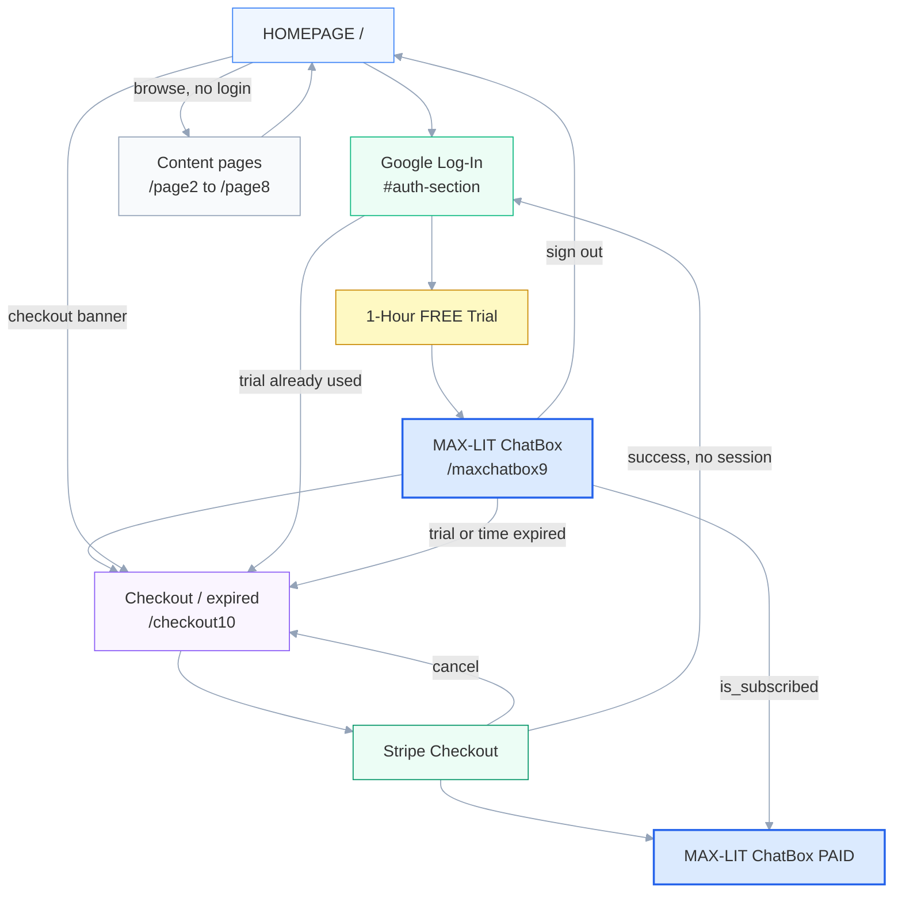

# MAX-LIT User Flows & Paths

Reference for every route, redirect, and user journey in **zzzbestmaxlit**.
Path constants live in `lib/trial-gate.ts`; the 10-page chain is in `lib/site-pages.ts`.

**Domains:** [einsteinerror.com](https://www.einsteinerror.com) (primary), [einsteingravity.com](https://www.einsteingravity.com) (alias)

---

## Canonical 10-page map

Footer **“Next Page →”** on each page follows this order (`lib/site-pages.ts`):

| # | URL | Purpose |
|---|-----|---------|
| 1 | `/` | Home, Google Sign-In, truth counter |
| 2–8 | `/page2` … `/page8` | Marketing / proof content |
| 9 | `/maxchatbox9` | MAX-LIT AI Chatbox (TRY) |
| 10 | `/checkout10` | Stripe checkout + expired access ($15 / $75 / $400) (PAY / EXPIRE) |

Legacy URLs (`/checkout11`, `/trialexpired10`, `/maxchatbox8`, etc.) are **not** redirected — they 404.

---

## Visual summary — SaaS user paths

**Main path (top → bottom):** HOMEPAGE → Google Log-In → 1-Hour FREE Trial → MAX-LIT ChatBox → Checkout (trial/time expired) → Stripe → ChatBox (paid)

**Flow chart image:** [`public/max-lit-saas-paths-chart.png`](public/max-lit-saas-paths-chart.png)



**Trial gate:** 1 hour from first sign-in (`profiles.trial_start_at`). After that, chat sends you to Trial Expired unless you have paid (`is_subscribed = true`).

---

## All user paths (by category)

### A. Content browsing (no sign-in)

- `/` → `/page2` → … → `/page8` via footer **Next Page**
- Pages 2–8: **HOME** link → `/`
- **Checkout banner** on `/` and `/page2` → `/checkout10` (skips pages 3–9)
- Pages 1–8, checkout, trial/time-expired pages are readable without logging in

### B. Sign-in entry points

| Entry | Flow | Lands on |
|-------|------|----------|
| Google button on home (primary) | Client `signInWithIdToken` → ensure profile | `/maxchatbox9` |
| `/auth/google` | OAuth → `/auth/callback` | `/maxchatbox9` or `/checkout10`* |
| Visit `/maxchatbox9` while logged out | Server redirect | `/#auth-section` |
| Stripe return, auth missing | Preserve `checkout_session_id` | `/?checkout_session_id=…#auth-section` |

\*Returning user whose 1-hour trial already expired → `/checkout10`.

**Sign-in errors:** `/?auth=error&reason=…`

**OAuth edge case:** Supabase sometimes returns `code` to `/` instead of `/auth/callback` — home forwards to callback automatically.

### C. Free trial chat (happy path)

```
/ → Google Sign-In → /maxchatbox9 → /api/chat
```

- First sign-in creates `profiles` with `trial_start_at = now`, `is_subscribed = false`
- Chat allowed for **1 hour** while trial active

### D. Trial / time expired (page 10 — `/checkout10`)

**Automatic:**

```
Logged in + trial > 1 hr + not paid + visit /maxchatbox9
  → /checkout10
```

Also enforced by middleware on `/maxchatbox9` and by `/api/chat` (403 “Trial expired”).

**After sign-in when trial already used:**

```
Google Sign-In → /maxchatbox9 → redirect → /checkout10
```

**From checkout page:** choose a Stripe tier or use footer navigation.

> **Note:** Stripe tiers are labeled 3 hr / 24 hr / 7 days, but code today only sets `is_subscribed = true` with **no paid-duration countdown**.

### E. Paid checkout (page 10)

| Path | Steps |
|------|--------|
| **F1 Standard** | `/checkout10` → tier → Stripe → `/maxchatbox9?session_id=cs_…` → fulfill → chat |
| **F2 Session lost after Stripe** | Stripe → `/maxchatbox9?session_id=…` → `/?checkout_session_id=…#auth-section` → sign in → `/maxchatbox9?session_id=…` → fulfill → chat |
| **F3 Webhook only** | Webhook sets `is_subscribed = true`; user signs in later → chat |
| **F4 Cancel** | Stripe cancel → `/checkout10` |
| **F5 Not signed in at checkout** | Click tier → “Sign in required” → `/#auth-section` |
| **F6 Skip to pricing** | Home banner “Link to MAX-LIT SUPERComputer” → `/checkout10` |

**Stripe config:** `success_url` → `/maxchatbox9?session_id={CHECKOUT_SESSION_ID}`; `cancel_url` → `/checkout10` (`lib/stripe/stripe-service.ts`).

### F. Subscribed user

```
is_subscribed = true → /maxchatbox9 always works; no trial-expiry redirects
```

Sign out from chat → `/`. Sign in again → `/maxchatbox9`.

### G. Site Tour (`?tour=1`)

```
Home “Site Tour” → /?tour=1 → float bar walks all 10 pages
```

Sign-in, chat, payments, and trial/time-expired clicks are **disabled** (preview UI only).

### H. Chat exit

From `/maxchatbox9`:

- **Home** → `/`
- **Sign out** → `/`

### I. Non-navigation UI

- **Purchases** on home → floating panel (no route change)
- External links (Vimeo, Amazon, Rumble, WhatsApp) → leave the site

### J. Dev-only (`NODE_ENV=development`)

| Route | Purpose |
|-------|---------|
| `/dev/reset` | Reset 1-hour trial → `/maxchatbox9` |
| `/dev/gemini` | Gemini API setup help |

---

## Redirect lookup (quick reference)

| Condition | Destination |
|-----------|-------------|
| Not logged in, visit chat | `/#auth-section` |
| Logged in, trial active | `/maxchatbox9` |
| Logged in, trial expired, not paid | `/checkout10` |
| Paid (`is_subscribed`) | `/maxchatbox9` |
| Stripe success | `/maxchatbox9?session_id=…` |
| Stripe cancel | `/checkout10` |
| Sign-in error | `/?auth=error` |

---

## Current routes (intentional)

| Item | Notes |
|------|--------|
| 10-page chain `/` … `/checkout10` | 8 content + chat + checkout; constants in `lib/trial-gate.ts` |
| `/maxchatbox9` | Canonical chat (page 9) |
| `/checkout10` | Stripe checkout + expired access (page 10) |
| `/#auth-section` | Sign-in anchor on home |
| `/?checkout_session_id=…` | Post-Stripe sign-in handoff |
| Site Tour `?tour=1` | Preview all pages without real auth/pay |

## Legacy URLs

Old numbered routes (`/checkout11`, `/trialexpired10`, `/timeexpired12`, `/maxchatbox8`, `/pricing`, etc.) **404** — no redirects in `next.config.ts`.

## Known product gaps

| Topic | Notes |
|-------|--------|
| Paid tier duration (3 hr / 24 hr / 7 days) | Only `is_subscribed = true` today — no `subscription_expires_at` |
| Dual trial tracking | DB `trial_start_at` + cookie `maxlit_trial_started_at` can diverge |
| `/auth/google` OAuth route | Exists alongside GIS button — two sign-in code paths |

---

## Key source files

| Concern | File(s) |
|---------|---------|
| Path constants | `lib/trial-gate.ts` |
| 10-page order | `lib/site-pages.ts` |
| Trial duration (1 hr) | `lib/trial.ts` |
| Middleware gates | `lib/supabase/middleware.ts` |
| Chat page + Stripe fulfill | `app/maxchatbox9/page.tsx` |
| Google sign-in | `components/google-login-button.tsx` |
| OAuth callback | `app/auth/callback/route.ts` |
| Stripe success/cancel URLs | `lib/stripe/stripe-service.ts` |
| Webhook fulfillment | `app/api/stripe/webhook/route.ts` |
| Chat API gate | `lib/chat-gatekeeper.ts` |
| Site Tour | `lib/site-tour.ts`, `components/site-tour-bar.tsx` |

---

## Related docs

- [RESTORE-POINT.md](./RESTORE-POINT.md) — deploy, secrets, Stripe webhook
- [FULL-SAAS-BACKUP/ARCHITECTURE.md](./FULL-SAAS-BACKUP/ARCHITECTURE.md) — stack & API overview
